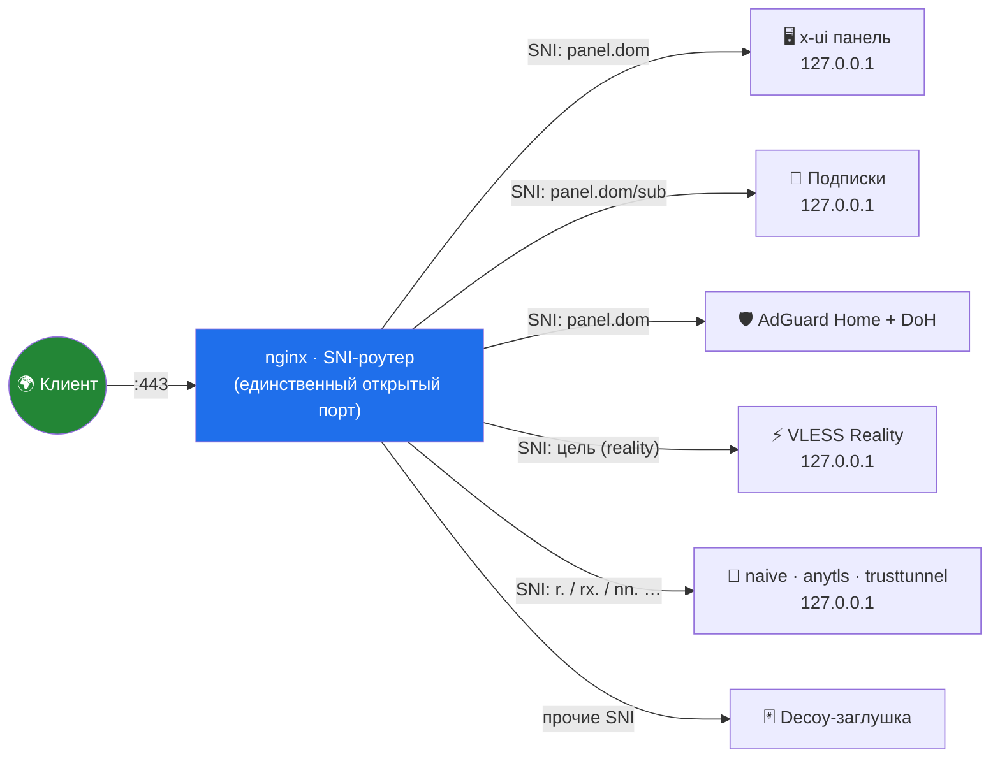

<div align="center">

# 🛰️ stack-manager.sh

### SNI-стек «всё за 443» в одном файле

**LucX / x-ui · AdGuard Home · nginx SNI-роутер · Reality · decoy · fail2ban · UFW · Let's Encrypt**


*Один bash-скрипт поднимает и обслуживает весь прокси-стек: от установки до починки.*
*Наружу смотрит единственный порт — 443. Всё остальное слушает 127.0.0.1.*

</div>

---

## ✨ Возможности

| | |
|:---|:---|
| 🔐 **«Всё за 443»** | Панель, подписки, DoH и все TCP-инбаунды живут за одним nginx-роутером по SNI. Наружу — только 443 и SSH. |
| 🎭 **Reality × 2** | **Чужой реалити** — маскировка под cloudflare/microsoft/sony/… (серт не нужен). **Свой SNI** — личный поддомен + LE-серт + decoy. |
| 🎯 **«Найти цели»** | Живая проверка кандидатов (TLS 1.3 + ALPN h2) и выбор цели списком — как кнопка в панели. |
| 🛡️ **AdGuard Home** | 3 режима: за корнем панели · отдельный SNI-домен · локально. DoH через 443, нативный TLS в yaml. |
| 🃏 **Decoy-шаблоны** | 13 заглушек для сканеров: корпоративный лендинг, блог, docs, Cloudflare-style, фейк-логины (Portainer, Pi-hole, Jellyfin, HA, Uptime Kuma…). |
| 📜 **Серты на автопилоте** | certbot + deploy-hook (перезапуск потребителей после renew) + таймер самолечения каждые 2 минуты. Серты только в `live/`. |
| 🚫 **fail2ban + UFW** | Баны по login-декоям; наружу открыто только необходимое, панельные порты — в DENY. |
| 🩹 **Самолечение** | hosts-починка, ре-привязка сертов, чистка мёртвых SNI-записей — само, без рук. |
| ⌨️ **Удобство** | `q` в любом вопросе → возврат в меню. Порты: запрет 443/80 и проверка занятости. URL подписок без `:443`. |

## 🗺️ Как это устроено



## 🚀 Быстрый старт

```bash
# 1. залить на сервер
scp ./stack-manager.sh root@SERVER:/root/stack-manager.sh

# 2. запустить
ssh root@SERVER
bash /root/stack-manager.sh
```

> [!TIP]
> Нужны: Ubuntu 22.04+/Debian 11+, root, домен с A-записью на сервер, открыты **22** и **443**.
> Дальше — п.1: скрипт сам поставит nginx, certbot, LucX, AdGuard, fail2ban и задаст вопросы по порядку:
> **панель (пароль/порты) → AdGuard (да/нет) → заглушка панели → инбаунды** (у каждого: свой/чужой reality → SNI → порт → своя заглушка).

## 📋 Меню

<details>
<summary><b>Развернуть все 18 пунктов</b></summary>

| Пункт | Действие |
|:---:|---|
| **1** | Первичная настройка SNI-роутера |
| **2** | Добавить / проверить inbound · создать · починить reality-dest |
| **3** | Удалить inbound |
| **4** | Сменить decoy для SNI-домена |
| **5** | Каталог decoy-шаблонов |
| **6** | Статус + доступы (URL панели / AdGuard / DoH, логины, пароли) |
| **7** | Статус login-декоев и баны fail2ban |
| **8–9** | Бэкап / восстановление конфигурации |
| **10** | Сертификаты: renew, dry-run |
| **11–12** | Файрвол: только нужные порты / восстановление из снимка |
| **13** | Установить панель LucX UI |
| **14** | Установить AdGuard Home |
| **15** | Очистка SNI от записей без инбаундов |
| **16** | Удалить AdGuard Home |
| **17** | Удалить панель → сразу предложить переустановку стека |
| **18** | Сменить пароли admin (панель / AdGuard, с проверкой наличия) |
| **0 / q** | Выход · `q` в любом вопросе — выход в меню |

</details>

## 🧠 Принципы

- **Один порт.** Наружу только 443: меньше сигнатур, меньше пробивов.
- **Тишина для сканера.** На чужой SNI — живая заглушка или прокси на настоящую цель, а не «connection refused».
- **Ничего лишнего в памяти.** Панель держит состояние in-memory — поэтому любая правка БД идёт по схеме *stop → edit → start*.
- **Секреты не в git.** Пароли генерируются на сервере: `/root/panel-credentials.txt`, `/root/adguard-credentials.txt` (0600).

## 📦 Установка на сервер одной строкой

```bash
curl -fsSL https://raw.githubusercontent.com/vladufqaa/stack-manager/main/stack-manager.sh -o /root/stack-manager.sh && bash /root/stack-manager.sh
```

---

<div align="center">

**MIT** · сделано для личного сервера · используйте в соответствии с законами вашей юрисдикции

⭐ — если пригодилось

</div>
