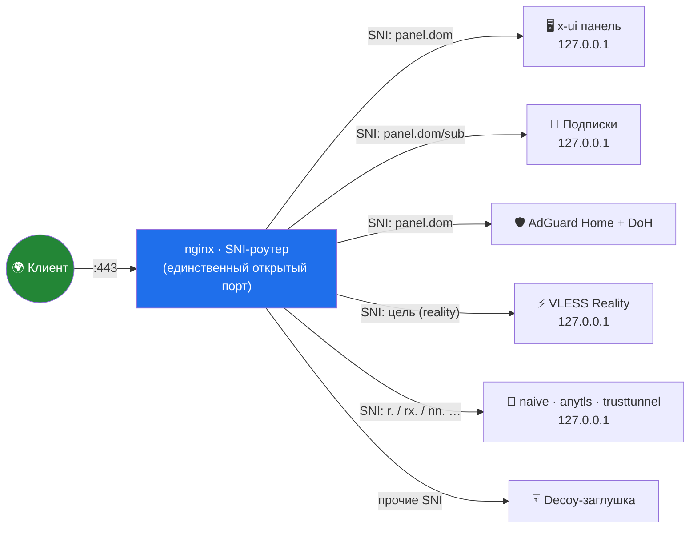

<div align="center">

# 🛰️ stack-manager

### SNI-стек «всё за 443» в одном файле

**LucX / x-ui · AdGuard Home · nginx SNI-роутер · Reality · decoy · fail2ban · UFW · Let's Encrypt**


*Один bash-скрипт поднимает и обслуживает весь прокси-стек: от установки до починки.*
*Наружу смотрит единственный порт — 443. Всё остальное слушает 127.0.0.1.*

</div>

---

## ✨ Возможности

| | |
|:---|:---|
| 🔐 **«Всё за 443»** | Панель, подписки, DoH и все TCP-инбаунды живут за одним nginx-роутером по SNI. Наружу — только 443 и SSH. |
| 🎭 **Reality × 2** | **Чужой реалити** — маскировка под cloudflare/microsoft/sony/… (серт не нужен). **Свой SNI** — личный поддомен + LE-серт + decoy. |
| 🎯 **«Найти цели»** | Живая проверка кандидатов (TLS 1.3 + ALPN h2) и выбор цели списком — как кнопка в панели. |
| 🖥️ **Меню с живыми счётчиками** | Шапка в реальном времени: 🟢/🔴 по каждому сервису, инбаунды, decoy-хиты за сутки, баны по всем jail'ам, минимальный срок сертов, диск, UFW. Рамки ровные на любой локали (ширина через python `east_asian_width`). |
| 🛡️ **AdGuard Home** | 3 режима: за корнем панели · отдельный SNI-домен · локально. DoH через 443, нативный TLS в yaml. Установка/удаление — единым пунктом по состоянию. |
| 🃏 **Decoy-заглушки 2.0** | 19 шаблонов + **custom** (свой index.html): статика (лендинг, блог, docs, Cloudflare, техработы, портфолио, магазин) + реплики логинов 1:1 (AdGuard Home, Portainer, Pi-hole, OMV, Jellyfin, Home Assistant, Uptime Kuma, cPanel, магазин). Режимы: **redirect 302** и **locked 401**. Шаблоны пишутся один раз — старт скрипта их не перетирает. |
| 🤖 **Анти-бот** | UA-свитч: сканерам (curl/python/nmap/…) — пустая 404, живому браузеру — сайт. Honeypot-ссылки (`/admin`, `/.env`, `/wp-login.php`) — касание = мгновенный бан. robots.txt в комплекте. |
| 📜 **Серты на автопилоте** | certbot + deploy-hook + таймер самолечения каждые 2 минуты. Серты только в `live/`. Email LE сохраняется и переживает перезапуски. Резолвер сам выбирает серт: **точный → wildcard → SAN** — wildcard и мультисерт (п.10.9, домены разных зон одной линией) живут рядом без конфликтов. |
| 🚫 **fail2ban + UFW** | Баны по login-декоям и honeypot-путям, jail **recidive** для рецидивистов, счётчик в шапке — по всем jail'ам. Файрвол с выбором политики (п.11): **allowlist** — наружу только необходимое, панельные порты в DENY, служебные залочены; **hide-only** — без reset, явно закрывается только спрятанное. |
| 🕶 **Стелс-аудит** | Взгляд на сервер глазами Shodan/Censys: открытые порты (TCP/UDP vs UFW), какой серт видит сканер на 443 без SNI, HTTP:80, SSH, open resolver, публичные имена из Certificate Transparency (crt.sh), подсказки по opt-out. Только чтение. |
| 🧽 **Гигиена nginx** | `server_tokens off` (идемпотентно, с размноженным дублем разбирается сам), security-заголовки на decoy-блоки через сниппет, logrotate для decoy-логов, если их не накрывает системный. |
| 🩹 **Самолечение** | hosts-починка, ре-привязка сертов, восстановление потерянных портов инбаундов и tg-маршрута, чистка мёртвых SNI-записей — само, без рук. Служебные инбаунды панели с портом 0 не трогает. **Заморозка** (п.25): `cert:<домен>` / `inbound:<id>` / `ALL-CERTS` — отмеченное автомика обходит молча. |
| 🛡 **Защита БД от перезаписи панелью** | SQL-триггеры в x-ui.db: панель при правке инбаунда может затереть вписанные скриптом пути сертов / reality-dest / hostname — триггер возвращает их на месте (легитимные правки и первичная запись проходят свободно). hosts защищён теневой таблицей: снесённые строки возвращает самолечение. Выключатель — п.25.5. |
| 🧭 **Двухфазная настройка** | п.1: сначала анкета (домен, email, креды, AdGuard, decoy, инбаунды, файрвол) → сводка **ПЛАН** → подтверждение → применение. Отмена на этапе плана = ничего не изменено. |
| 🫥 **Автодетект «голых» инбаундов** | Создал инбаунд руками в панели, а порт закрыт файрволом? п.2 сам увидит TCP-инбаунды вне 443 и предложит спрятать (SNI + серт + hosts по очереди). vless/trojan+TLS получают **fallback-заглушку** на nginx :80 — пробой браузером увидит сайт, а не reset. |
| 🚚 **Переезд домена панели** | п.10.8: серт нового домена + webDomain/hosts в БД + nginx (SNI-карта, маркер decoy) + credentials одним проходом, с бэкапом и откатом; старый серт опционально отзывается. |
| ⏪ **Откат и снимки** | п.23 — пошаговый демонтаж стека с подтверждением каждого шага; п.24 — pre-install снимок «как было до скрипта» и восстановление из него. |
| 🩺 **Диагностика** | п.18 «Доктор»: сервисы, порты (TCP-транспорты vs UDP — по протоколу), серты, диски, reboot-required, UFW, DNS всех доменов, таймер — разово или непрерывно. п.19 «Инбаунды live»: таблица в реальном времени (слушается/серт/клиенты/трафик). |
| 📜 **Аудит действий** | Каждая операция, меняющая систему — строка в `/root/stack-actions.log` (дата · кто · что). |
| ⌨️ **Удобство** | `q` в любом вопросе → возврат в меню. Смена домена инбаунда без пересоздания. Порты: запрет 443/80 и проверка занятости. URL подписок без `:443`. Плейсхолдеры `*.example.com` в меню не проходят. |

## 🗺️ Как это устроено



## 🚀 Быстрый старт

```bash
# 1. залить на сервер
scp ./stack-manager.sh root@SERVER:/root/stack-manager.sh

# 2. запустить
ssh root@SERVER
bash /root/stack-manager.sh
```

> [!TIP]
> Нужны: Ubuntu 22.04+/Debian 11+, root, домен с A-записью на сервер, открыты **22** и **443**.
> Дальше — п.1, двухфазно: сначала анкета (**панель (пароль/порты) → AdGuard (да/нет) → заглушка → инбаунды → файрвол**),
> затем сводка **ПЛАН** и только после подтверждения — применение. Отмена на этапе плана ничего не меняет.
>
> Повторный запуск п.1 на настроенном стеке вежливо откажет — по умолчанию конфигурацию не трогает.

## 📋 Меню

<details>
<summary><b>Развернуть все 25 пунктов</b></summary>

| Пункт | Действие |
|:---:|---|
| **1** | Первичная настройка SNI-роутера — двухфазная: анкета (домен/email/креды/AdGuard/decoy/инбаунды/файрвол) → сводка ПЛАНА → подтверждение → применение |
| **2** | Добавить / проверить inbound · создать · починить reality-dest · **автодетект**: руками созданные в панели TCP-инбаунды вне 443 (порт закрыт файрволом) — предложение спрятать |
| **3** | Удалить inbound (список всех, включая UDP; SNI-домены как маркеры) |
| **4** | Сменить decoy: 19 шаблонов + custom-шаблон + режимы redirect/locked + вопрос «прятать от ботов?» |
| **5** | Каталог decoy-шаблонов · пересборка всех блоков · «проверить как посторонний» (человек vs сканер) |
| **6** | Статус + доступы (URL панели / AdGuard / DoH, логины, пароли) |
| **7** | Безопасность: баны fail2ban, деко-логины, whitelist · статистика decoy-посещений за 24ч · «забанить всех, кто открывал decoy» · живой лог fail2ban |
| **8** | Бэкап конфигурации |
| **9** | Восстановить из бэкапа |
| **10** | Сертификаты: renew, dry-run, wildcard, выпуск через панель, обзор сертов+email, **переезд домена панели**, **мультисерт SAN** (домены разных зон одним сертом, рядом с wildcard) |
| **11** | Файрвол с выбором политики: **allowlist** (reset, только нужное) / **hide-only** (без reset, deny панельных+11443) |
| **12** | Восстановить состояние файрвола из снимка |
| **13** | Панель LucX UI: установить / удалить — единый пункт, сам видит, стоит ли |
| **14** | AdGuard Home: установить / удалить — аналогично |
| **15** | Очистка SNI от записей без инбаундов (tg-маршрут восстанавливается сам) |
| **16** | Сменить пароли admin (панель / AdGuard, с проверкой наличия) |
| **17** | Обновить сам скрипт (raw.githubusercontent с cache-buster) |
| **18** | Доктор: сервисы, порты, серты, диски, reboot-required, UFW, DNS всех доменов, heal-таймер — разово или режим наблюдения |
| **19** | Инбаунды live: таблица (слушается/серт/клиенты/трафик) — UDP по протоколу, port-hopping как `✓*` |
| **20** | Сменить домен инбаунда без пересоздания (БД + hosts + SNI-карта + серты + decoy) |
| **21** | Гигиена nginx: server_tokens off, security-заголовки decoy, ротация логов |
| **22** | Стелс-аудит: глазами Shodan/Censys — порты, серт 443 без SNI, HTTP:80, SSH, DNS, crt.sh, opt-out |
| **23** | Полный откат / демонтаж стека по шагам (сервисы, конфиги, порты, файрвол) — с подтверждением каждого шага |
| **24** | Pre-install снимок: сохранить состояние «до скрипта» / восстановить его |
| **25** | ❄ Заморозка самолечения: `cert:<домен>` / `inbound:<id>` / `ALL-CERTS` + **защита БД** вкл/выкл (SQL-триггеры: панель не затирает серты/dest/hostname) |
| **0 / q** | Выход · `q` в любом вопросе — выход в меню |

</details>

## 🧠 Принципы

- **Один порт.** Наружу только 443: меньше сигнатур, меньше пробивов.
- **План прежде изменений.** п.1 сначала собирает анкету и показывает план — применение только после явного подтверждения.
- **Замороженное свято.** Что отмечено в п.25 — автомика (heal-таймер, авто-выпуск сертов) обходит молча; ручные пункты меню работают как обычно.
- **Тишина для сканера.** На чужой SNI — живая заглушка или прокси на настоящую цель, а не «connection refused».
- **Тихий старт.** Скрипт при каждом запуске проверяет состояние молча и пишет в консоль только то, что реально сделал: панель не дёргается, шаблоны не перетираются, логи не шумят.
- **Ничего лишнего в памяти.** Панель держит состояние in-memory — поэтому любая правка БД идёт по схеме *stop → edit → start*.
- **Действия — под учёт.** Каждая системная операция попадает в `/root/stack-actions.log`.
- **Секреты не в git.** Пароли генерируются на сервере: `/root/panel-credentials.txt`, `/root/adguard-credentials.txt` (0600).

## 📦 Установка на сервер одной строкой

```bash
curl -fsSL https://raw.githubusercontent.com/vladufqaa/stack-manager/main/stack-manager.sh -o /root/stack-manager.sh && bash /root/stack-manager.sh
```

---

<div align="center">

**MIT** · сделано для личного сервера · используйте в соответствии с законами вашей юрисдикции

⭐ — если пригодилось

</div>
